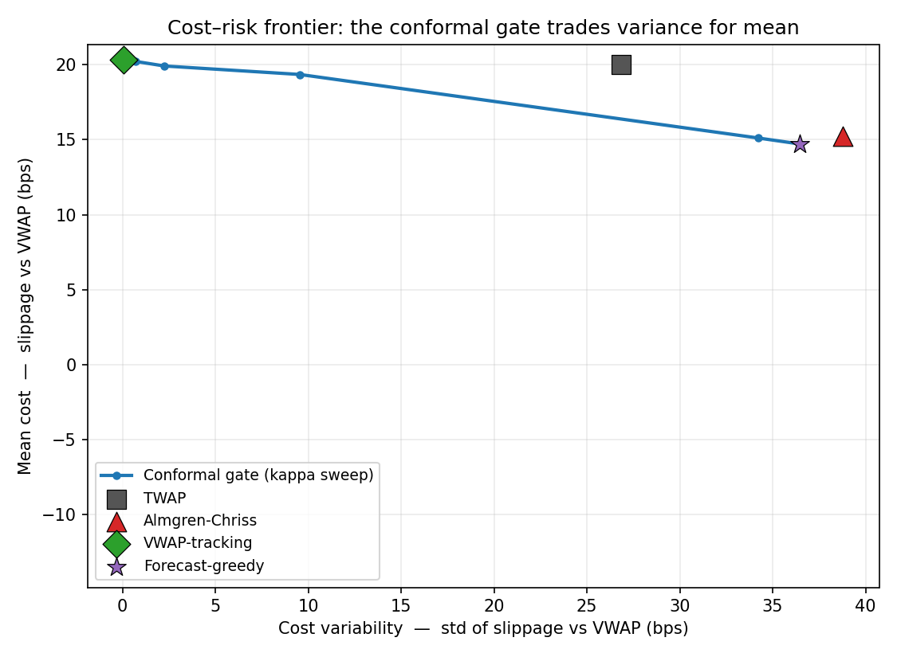

# Uncertainty-Aware Execution: Conformal Prediction vs. Reinforcement Learning

[](https://doi.org/10.19139/soic-2310-5070-4159)
[](LICENSE)
[](https://github.com/ShaonINT/conformal-vwap-execution/actions/workflows/ci.yml)
[](https://www.python.org/)

Reference code for the paper:

> **Uncertainty-Aware AI: Conformal Prediction versus Reinforcement Learning for Optimal Trade Execution**
> Asadullah Irshad and Shaon Biswas.
> *Statistics, Optimization & Information Computing*, 16(2), 1334–1349, 2026.
> DOI: [10.19139/soic-2310-5070-4159](https://doi.org/10.19139/soic-2310-5070-4159)
> Publisher page: [iapress.org](https://iapress.org/index.php/soic/article/view/4159) · Published version: [`paper/`](paper/)

A fully reproducible study of VWAP-benchmarked trade execution inside a controlled
simulator (stochastic volatility + latent AR(1) momentum). Classical schedules, a
multi-seed PPO agent, and forecast-driven policies built on a **normalised
split-conformal predictor** are placed on a common **cost–risk frontier**. The
headline result: a distribution-free conformal *gate* converts an unstable
forecast edge into a tunable, reproducible variance reduction — more dependably
than an off-the-shelf RL agent.

> Simulator-based research. **No live-trading claims.**

---

## The one-paragraph idea

Execution desks do not need to predict the market; the trade is already decided.
What they need is to work a large order to beat VWAP at low cost *and* low
cost-variance. A point return-forecast can lower average cost but adds variance,
because acting on every forecast realises the wrong ones. A conformal prediction
interval supplies the missing ingredient — a calibrated measure of *when the
forecast can be trusted* — and using its width as a **gate** lets the policy take
the reliable bets and decline the rest. Because the gate is an explicit rule with
a coverage guarantee, its risk dial is directly controllable, unlike a PPO agent
that must discover both signal and caution from a scalar reward.

## What's here

```
src/uae/
  simulator.py     # SV + latent-AR(1) market; U-shaped volume; linear impact + costs
  benchmarks.py    # Immediate, TWAP, VWAP-tracking, Almgren–Chriss schedules
  features.py      # causal features for the return predictor (no look-ahead)
  conformal.py     # gradient-boosted predictor + normalised split-conformal interval
  policies.py      # Forecast-greedy and the conformal GATE (|f| > kappa * half-width)
  rl_env.py        # Gymnasium execution MDP (state/action/reward per the paper)
  ppo.py           # Stable-Baselines3 PPO training + evaluation
  experiments.py   # walk-forward splits, results table, cost–risk frontier, coverage
scripts/
  run_experiments.py  # baselines + conformal + frontier + coverage  -> results/
  make_figures.py     # cost_risk_frontier.png, coverage.png
  run_ppo.py          # train PPO over seeds, append PPO row to the table
results/              # generated CSVs and figures
paper/                # the published article (PDF) and its LaTeX/Word sources
docs/research_plan.md # the original working research plan
article/              # a long-form write-up of the result for a general audience
```

## Quick start

```bash
git clone https://github.com/ShaonINT/conformal-vwap-execution.git
cd conformal-vwap-execution

python -m venv .venv && source .venv/bin/activate
pip install -r requirements.txt

python scripts/run_experiments.py     # baselines + conformal + frontier + coverage
python scripts/make_figures.py        # writes results/*.png
python scripts/run_ppo.py --seeds 0 1 2 --timesteps 150000   # PPO comparator (needs torch)
```

The conformal pipeline runs in well under a minute on a laptop CPU; only the PPO
comparator is slow. Everything is seeded (`ExperimentConfig.seed`) and the config
is saved to `results/config.json` on every run.

Every push runs `scripts/run_experiments.py` in CI and **fails the build** if
empirical conformal coverage drifts more than 2 percentage points from nominal,
or if tightening the gate stops reducing cost variance. The claims in this README
are therefore checked, not asserted.

## Method in one diagram

```
market state ─► gradient-boosted return forecast ─► normalised split-conformal interval
                                                             │  (half-width ∝ local vol)
                                                             ▼
                                        gate:  |forecast| > kappa · half-width ?
                                                   │yes                  │no
                                                   ▼                     ▼
                                     tilt the VWAP schedule        track VWAP
```

`kappa` is the single interpretable dial: `kappa = 0` recovers Forecast-greedy
(always act); large `kappa` recovers VWAP-tracking (never act).

## Results (this implementation, simulator, 250 held-out seeds)

| Method | Slippage vs VWAP mean (bps) | std (bps) |
|---|---|---|
| TWAP | 20.0 | 26.8 |
| Almgren–Chriss | 15.3 | 38.8 |
| VWAP-tracking | 20.3 | 0.1 |
| Forecast-greedy | 14.7 | 36.4 |
| Conformal-gated (κ=0.5) | 19.6 | 7.8 |
| Conformal-gated (κ=1.0) | 20.2 | 0.6 |

Split-conformal empirical coverage: **89.9%** at the 90% nominal level.



The story reproduces cleanly: VWAP-tracking is a near-zero-variance reference;
Forecast-greedy lowers mean cost but adds large variance; the conformal gate
sweeps a **monotone frontier** between them; and TWAP / Almgren–Chriss sit
*dominated* off the frontier. The PPO agent (see below) is high-variance across
seeds and does not reliably beat the volume-aware schedules.

Figures in the last decimal place may shift by ±0.1 bps across platforms: the
gradient-boosted fit is not bit-identical across BLAS builds. The qualitative
ordering, the coverage level, and the monotone frontier are stable.

### Relationship to the published numbers

This is an **independent reference implementation** written to reproduce the
paper's *mechanism* and qualitative findings. It matches the paper on the load-
bearing results — ~90% conformal coverage, the zero-variance VWAP-tracking
reference at ~20 bps, Forecast-greedy trading mean for variance, and the monotone
gating frontier. Absolute basis-point magnitudes and the exact κ-response depend
on simulator constants (impact coefficient, momentum persistence, vol-of-vol)
that are not fully specified in the article, so they differ in level from the
published tables. **The paper's Table 1 is the authoritative result:**

| Method | mean (bps) | std (bps) |
|---|---|---|
| Immediate | 332.1 | 296.8 |
| TWAP | 25.1 | 38.0 |
| Almgren–Chriss | 50.8 | 237.3 |
| VWAP-tracking | 20.0 | 0.0 |
| PPO (RL, 3 seeds) | 33.9 | 115.9 |
| Forecast-greedy | 17.0 | 19.1 |
| Conformal-gated (κ=0.5) | 19.1 | 13.8 |
| Conformal-gated (κ=1.0) | 19.4 | 10.0 |

On real intraday data (30 US large-caps, 5-min bars, 450 held-out sessions) the
paper reports coverage of 90.7% and a persistent variance-reduction from gating,
while noting the forecast edge on liquid large-caps is thin (~0.2 bps).

## Reproducibility notes

- **Walk-forward splits.** Train / calibration / test are disjoint seed ranges;
  the test window is never used for tuning.
- **Transaction costs** are always on (a fixed spread/impact floor plus
  participation-linked temporary and permanent impact).
- **Multi-seed**, never single-run: metrics are mean ± std over held-out seeds.
- **Seeds and config** are saved with every run.

## Citation

Please cite the paper:

```bibtex
@article{irshad2026uncertainty,
  title   = {Uncertainty-Aware AI: Conformal Prediction versus Reinforcement
             Learning for Optimal Trade Execution},
  author  = {Irshad, Asadullah and Biswas, Shaon},
  journal = {Statistics, Optimization \& Information Computing},
  volume  = {16},
  number  = {2},
  pages   = {1334--1349},
  year    = {2026},
  doi     = {10.19139/soic-2310-5070-4159}
}
```

The software itself is archived on Zenodo and has its own DOI; see
`CITATION.cff` for the machine-readable version of both.

## License

Code released under the MIT License (see `LICENSE`). The article in `paper/` is
© the authors, published open access by International Academic Press under
CC-BY; redistribution here follows that licence, with attribution as above.
