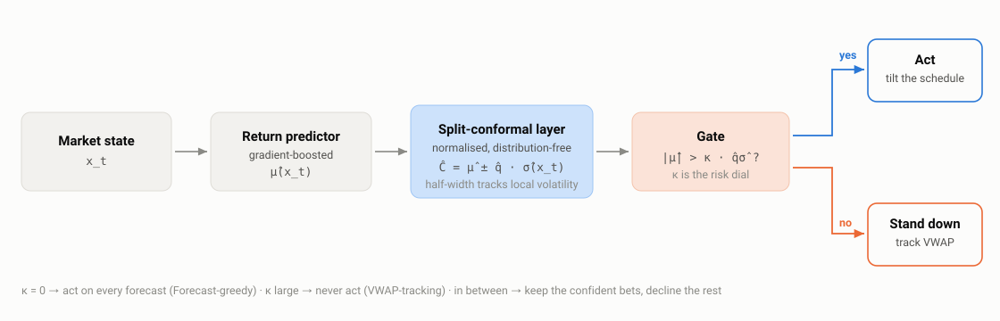
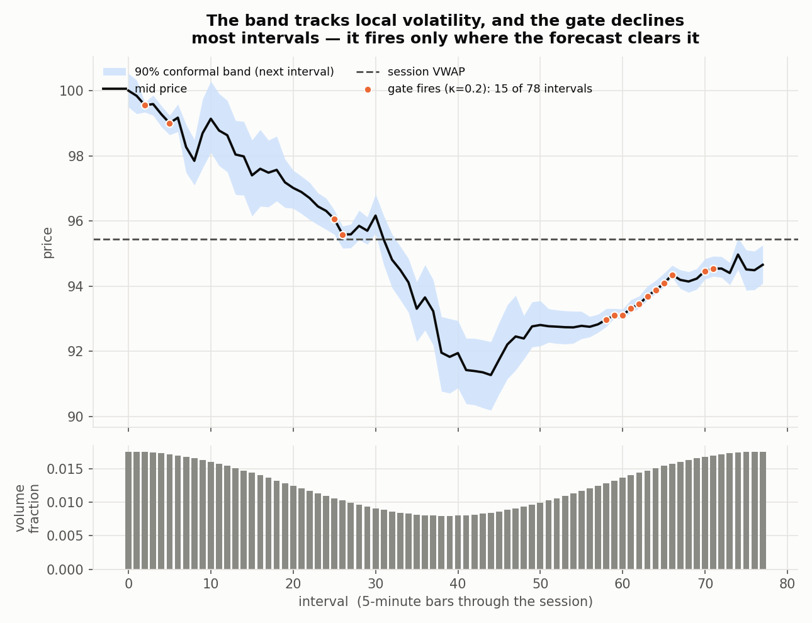
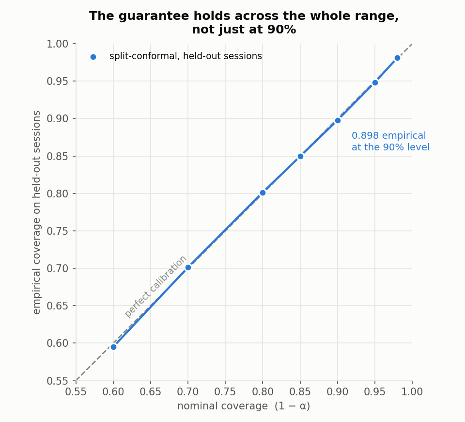
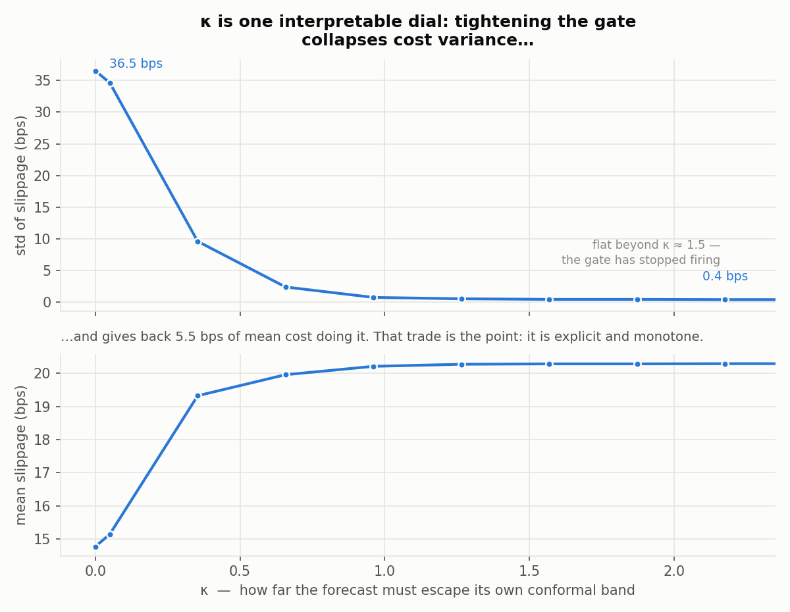

# Uncertainty-Aware Execution — Conformal Prediction vs. Reinforcement Learning

[](https://doi.org/10.19139/soic-2310-5070-4159)
[](https://doi.org/10.5281/zenodo.21879953)
[](LICENSE)
[](https://github.com/ShaonINT/conformal-vwap-execution/actions/workflows/ci.yml)
[](https://www.python.org/)

**The most useful part of a trading model can be knowing when to ignore it.**
This repository is the reference implementation for a study of VWAP-benchmarked
trade execution in which a distribution-free uncertainty layer — not a learned
policy — turns an unstable forecast edge into a controllable reduction in
execution risk.

<p align="center">
  
</p>

> **Uncertainty-Aware AI: Conformal Prediction versus Reinforcement Learning for Optimal Trade Execution**
> Asadullah Irshad and Shaon Biswas
> *Statistics, Optimization & Information Computing*, **16**(2), 1334–1349, 2026
> [`10.19139/soic-2310-5070-4159`](https://doi.org/10.19139/soic-2310-5070-4159) · [publisher page](https://iapress.org/index.php/soic/article/view/4159) · [published PDF](paper/)

> Simulator-based research. **No live-trading claims.**

---

## The idea

An execution desk does not get to decide *whether* to trade — that decision
arrives from upstream. What is left is operational: work a large parent order
through the session so the average fill price beats the volume-weighted average
price, at low cost **and** low cost-variance.

A point return-forecast can lower average cost, but it raises variance, for an
almost tautological reason: every forecast is sometimes wrong, and acting on all
of them realises every mistake. What is missing is not a better forecast. It is
a calibrated sense of *when the forecast deserves to be acted on*.

Split-conformal prediction supplies exactly that — a distribution-free,
finite-sample interval around any predictor. Most uncertainty work in trading
stops there, at a better error bar. Here the interval's **width becomes a gate**:
act on the forecast only when its magnitude escapes its own uncertainty band,

```
act  ⟺  |μ̂(x_t)|  >  κ · q̂ · σ̂(x_t)
```

and otherwise defer to the VWAP schedule. The multiple **κ is a single
interpretable dial** with a coverage interpretation attached — which is precisely
what a reinforcement-learning agent, forced to discover both signal and caution
from one scalar reward, does not give you.

## What the experiments show

**The band tracks local volatility, and the gate declines most intervals.**
It widens when the market turns choppy and contracts when it settles, so its
width carries information rather than being a margin bolted on after the fact.



**The guarantee holds — and not only at the level it was tuned for.** Sweeping
the nominal level traces the diagonal almost exactly on held-out sessions;
empirical coverage is 89.9% against a 90% nominal target.

<p align="center">
  
</p>

**κ sweeps a monotone cost–risk frontier**, and the classical schedules sit
*off* it. VWAP-tracking is a near-zero-variance reference; Forecast-greedy buys
a lower mean with a large variance; the gate moves smoothly between them. TWAP
and Almgren–Chriss are dominated — the latter markedly, because front-loading
ignores the volume curve and concentrates impact.


**The dial is explicit, and so is its price.** Tightening κ collapses the
standard deviation of execution cost from 36.4 bps to under 1 — and gives back
about 5.6 bps of mean cost doing it. That trade is not free, and the point is not
that it is free: it is that the trade is *monotone, visible, and yours to
choose*, rather than an emergent property of a training run.



### Results — this implementation, 250 held-out seeds

| Method | Slippage vs VWAP, mean (bps) | std (bps) |
|---|---:|---:|
| TWAP | 20.0 | 26.8 |
| Almgren–Chriss | 15.3 | 38.8 |
| VWAP-tracking | 20.3 | 0.1 |
| Forecast-greedy | 14.7 | 36.4 |
| Conformal-gated (κ = 0.5) | 19.6 | 7.8 |
| Conformal-gated (κ = 1.0) | 20.2 | 0.6 |

Split-conformal empirical coverage: **89.9%** at the 90% nominal level.

### The RL comparator

The PPO agent was not strawmanned: normalised observations and rewards, a
sensible network, 150,000 timesteps. The one discipline imposed was to train it
across three seeds and **report all of them** rather than keeping the best. That
discipline is the finding — pooled across seeds the agent is high-variance and
does not reliably beat the volume-aware schedules, and individual runs range from
competitive to substantially worse. A single-seed write-up could have presented
this as a success.

## Quick start

```bash
git clone https://github.com/ShaonINT/conformal-vwap-execution.git
cd conformal-vwap-execution

python -m venv .venv && source .venv/bin/activate
pip install -r requirements.txt

python scripts/run_experiments.py    # baselines + conformal + frontier + coverage
python scripts/make_figures.py       # regenerate every figure above
python scripts/run_ppo.py --seeds 0 1 2 --timesteps 150000   # PPO comparator (needs torch)
```

The conformal pipeline runs in well under a minute on a laptop CPU; only the PPO
comparator is slow. Everything is seeded (`ExperimentConfig.seed`), and the full
config is written to `results/config.json` on every run.

## Reproducibility

The claims above are **checked, not asserted**. Every push runs the pipeline in
CI on a clean runner and fails the build if

- empirical conformal coverage drifts more than 2 percentage points from nominal, or
- tightening the gate stops reducing cost variance.

Beyond that:

- **Walk-forward splits.** Train, calibration and test are disjoint seed ranges; the test window is never used for tuning.
- **Transaction costs are always on** — a fixed spread/impact floor plus participation-linked temporary and permanent impact.
- **Multi-seed, never single-run.** Metrics are mean ± std over held-out seeds.
- **Seeds and config are saved** with every run.

Figures may shift in the last decimal place across platforms — the
gradient-boosted fit is not bit-identical across BLAS builds. The qualitative
ordering, the coverage level and the monotone frontier are stable.

### Relationship to the published numbers

This is an **independent reference implementation**, written to reproduce the
paper's *mechanism* and qualitative findings. It matches the paper on the
load-bearing results: ~90% conformal coverage, the zero-variance VWAP-tracking
reference at ~20 bps, Forecast-greedy trading mean for variance, and the monotone
gating frontier. Absolute magnitudes and the exact κ-response depend on simulator
constants — impact coefficient, momentum persistence, vol-of-vol — that are not
fully specified in the article, so they differ in level from the published
tables, and the mean-for-variance trade is steeper here than in the paper.
**The paper's Table 1 is the authoritative result:**

| Method | mean (bps) | std (bps) |
|---|---:|---:|
| Immediate | 332.1 | 296.8 |
| TWAP | 25.1 | 38.0 |
| Almgren–Chriss | 50.8 | 237.3 |
| VWAP-tracking | 20.0 | 0.0 |
| PPO (RL, 3 seeds) | 33.9 | 115.9 |
| Forecast-greedy | 17.0 | 19.1 |
| Conformal-gated (κ = 0.5) | 19.1 | 13.8 |
| Conformal-gated (κ = 1.0) | 19.4 | 10.0 |

On real intraday data — 30 US large-caps, 5-minute bars, 450 held-out sessions —
the paper reports coverage of 90.7% and a persistent variance reduction from
gating, while being explicit that the tradable edge on liquid large-caps is thin
(~0.2 bps).

## Repository layout

```
src/uae/
  simulator.py     # SV + latent-AR(1) market; U-shaped volume; linear impact + costs
  benchmarks.py    # Immediate, TWAP, VWAP-tracking, Almgren–Chriss schedules
  features.py      # causal features for the return predictor (no look-ahead)
  conformal.py     # gradient-boosted predictor + normalised split-conformal interval
  policies.py      # Forecast-greedy and the conformal gate
  rl_env.py        # Gymnasium execution MDP (state / action / reward per the paper)
  ppo.py           # Stable-Baselines3 PPO training and evaluation
  experiments.py   # walk-forward splits, results table, frontier, coverage
scripts/
  run_experiments.py  # baselines + conformal + frontier + coverage  ->  results/
  make_figures.py     # every figure in this README
  run_ppo.py          # train PPO across seeds, append the PPO row to the table
results/              # generated CSVs and figures
paper/                # the published article, plus the LaTeX body and its figures
```

## Citation

Please cite the paper:

```bibtex
@article{irshad2026uncertainty,
  title   = {Uncertainty-Aware AI: Conformal Prediction versus Reinforcement
             Learning for Optimal Trade Execution},
  author  = {Irshad, Asadullah and Biswas, Shaon},
  journal = {Statistics, Optimization \& Information Computing},
  volume  = {16},
  number  = {2},
  pages   = {1334--1349},
  year    = {2026},
  doi     = {10.19139/soic-2310-5070-4159}
}
```

To cite this software specifically, use its Zenodo archive:

```bibtex
@software{irshad2026uae_software,
  title     = {Uncertainty-Aware Execution: Conformal Prediction vs.
               Reinforcement Learning for Optimal Trade Execution},
  author    = {Irshad, Asadullah and Biswas, Shaon},
  year      = {2026},
  version   = {1.0.0},
  publisher = {Zenodo},
  doi       = {10.5281/zenodo.21879953},
  url       = {https://doi.org/10.5281/zenodo.21879953}
}
```

`CITATION.cff` carries the machine-readable form of both — GitHub's
**Cite this repository** button reads it directly.

## License

Code released under the MIT License (see [`LICENSE`](LICENSE)). The article in
[`paper/`](paper/) is © the authors, published open access by International
Academic Press under CC-BY; it is redistributed here with attribution as above.
The journal's LaTeX class and logo are **not** included — see
[`paper/source/README.md`](paper/source/README.md).
