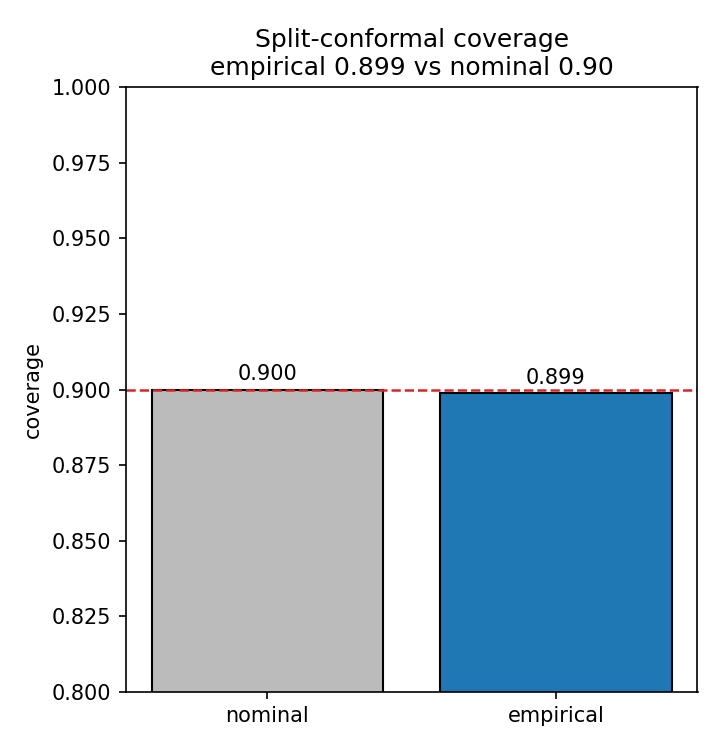

# The Best Part of a Trading Model Might Be Knowing When to Ignore It

*I spent a long time convinced that most machine-learning-for-trading results are noise. So I set a student a narrower problem — and a small conformal-prediction layer quietly beat our reinforcement-learning agent at it.*

---

I'll admit my prior up front, because it shaped everything that follows. I don't believe most of the machine-learning-for-trading literature replicates. The papers look strong in isolation, but the experimental settings drift from one to the next, the market-impact assumptions are often unstated, and far too many headline results rest on a single training run that happened to go well. Every survey of the field says a version of this out loud. It's an open secret.

So when I started shaping this project — which became a paper with Asadullah Irshad, who did the heavy lifting of building and running everything — I deliberately steered us away from the usual game. I didn't want another agent that "beats the market." I wanted to ask a smaller, more defensible question, and answer it in a way someone else could actually reproduce: **for a problem where the objective is genuinely agreed, which methods deliver cost reductions that are robust, controllable, and reproducible?**

The answer surprised even me in its tidiness. The most useful component we built was not the reinforcement-learning agent. It was a small, unglamorous uncertainty layer whose entire job was to decide *when a forecast deserved to be acted on at all*.

## Why execution, and why I framed it this way

If you think returns are largely unpredictable — and on liquid names at short horizons, I do — then the interesting edge isn't in forecasting direction. It's in execution and risk control. That reframing is deliberate. It takes a problem where success is unfalsifiable (did your alpha work, or did you get lucky?) and replaces it with one where success is bounded and measurable.

The setting is optimal trade execution. A desk has already decided to sell a large parent order; the decision is made. What's left is purely operational: how do you slice that order across the trading day so your average sale price is as close as possible to the day's volume-weighted average price, the VWAP? Trade too fast and you move the price against yourself through market impact. Trade too slowly and you're exposed to the price drifting away while you wait. Everyone agrees on the benchmark, everyone agrees on the cost axes. Reviewers can actually evaluate whether you succeeded. That was the point.

Execution is sequential and taken under uncertainty, which is exactly why people reach for reinforcement learning. I wanted to test that reflex against something far simpler — and to make the comparison honest by putting every method inside one Markov decision process, with one reward and one evaluation pipeline.

## The idea I actually wanted to test

Here's the intuition I asked Asadullah to build around.

Suppose you have a forecast of the next interval's return. The naive thing is to act on it: trade a little more when it's favourable, a little less when it isn't. Call that **Forecast-greedy**. It does something seductive and dangerous at the same time — it lowers your *average* cost below plain VWAP-tracking, but it noticeably *increases the variance* of that cost. The reason is almost tautological: every forecast is sometimes wrong, and if you act on all of them, you dutifully realise every mistake.

Lower mean, higher risk. For a desk judged on consistency, that's not a free win. It's a trade you might not want.

What's missing isn't a better point forecast. It's a calibrated sense of *when the forecast can be trusted*. And that is precisely what conformal prediction provides.

Split-conformal prediction takes any predictor and, using a held-out calibration set, wraps its point forecast in an interval with a **distribution-free, finite-sample coverage guarantee**: set it for 90%, and it covers the truth about 90% of the time, with no assumptions about the underlying distribution. We used the normalised variant, so the interval width scales with local volatility — wide in turbulent stretches, narrow in calm ones.

Most uncertainty work in trading stops there, at a nicer-looking error bar. My instinct was that the *width itself* is the signal. So the design we tested uses it as a **gate**: act on the forecast only when the forecast escapes its own uncertainty band — when its magnitude exceeds a multiple, κ, of the conformal half-width. Otherwise, defer to the VWAP schedule.

That κ turns out to be the whole product. It's a single, interpretable dial:

- **κ = 0** — act on everything. That's Forecast-greedy: lowest mean, highest variance.
- **κ large** — act on almost nothing. That's VWAP-tracking: benchmark mean, essentially zero variance.
- **in between** — you keep the confident bets and quietly decline the rest.

## What came out

Two results mattered to me more than the rest.

First, the guarantee held out of sample. On fresh simulated days, empirical coverage at the 90% level came out to **90.2%**. The interval does what it promises.

Second — and this is the part I find genuinely useful — sweeping κ traces a smooth, **monotone cost–risk frontier**. As you tighten the gate, the standard deviation of execution cost falls from 19.1 basis points with no gate, to 13.8, to 10.0, while the mean barely moves. The dispersion reduction isn't a fluke of sampling; a Wilcoxon test puts it past any reasonable doubt. In plain terms, we handed the desk one knob that chooses its operating point on the risk axis, with a coverage interpretation attached to it.

The classical schedules land where theory says they should. VWAP-tracking is a strong, near-zero-variance reference, because its only systematic cost is impact and the volume-proportional schedule is exactly what minimises impact. TWAP and Almgren–Chriss are both worse — the latter markedly, because front-loading ignores the volume curve and concentrates impact. They sit *off* the frontier, dominated by the gated policies.

## The reinforcement-learning agent, and why we reported every seed

We didn't strawman the RL agent. It got normalised observations and rewards, a sensible network, and 150,000 timesteps of training. The one discipline we imposed was to train it with three different seeds and **report all of them**, rather than quietly keeping the best.

That discipline is the finding. Pooled across seeds, PPO landed at 33.9 bps mean slippage with a standard deviation of **115.9 bps** — worse on both axes than the simple volume-aware schedules. Individual runs ranged from competitive with VWAP-tracking to substantially worse. A single-seed write-up could have dressed this up as a success. The instability *across* seeds is the honest result, and it's exactly the kind of thing the field's reproducibility problem is made of.

I want to be careful not to over-claim here, and we said so in the paper. This is not proof that RL can't do execution. A tuned, risk-sensitive, distributional agent with a real budget might well match or beat the gate. The point is narrower and more practical: the off-the-shelf agent has to discover *both* the timing signal *and* the right amount of caution from a single scalar reward, and in our hands it did that unreliably. The conformal gate gets the "how cautious to be" half for free, as an explicit rule you can read off a page.

## Then we tried it on real markets

A simulator with momentum baked in is a soft test — of course a forecaster finds the edge you planted. So we re-ran the conformal pipeline on real intraday data: thirty US large-caps, 5-minute bars, strictly time-ordered splits, 450 held-out sessions.

The load-bearing result transferred. At the 90% level, empirical coverage on real markets was **90.7%**. That matters because real intraday returns are not exchangeable, so the conformal guarantee is not automatic — confirming it empirically was the whole point of the exercise, and it answered the obvious worry that coverage in simulation only held because we built exchangeability in by hand.

We were equally clear about what didn't transfer. Real 5-minute returns on liquid large-caps are barely predictable, so the forecast edge over VWAP-tracking shrank to roughly 0.2 bps. The machinery behaves exactly as designed; there's simply very little edge to harvest at that frequency and liquidity. Honestly, I prefer this outcome to a suspiciously large number. It says the statistical guarantee is robust from simulation to reality, while being candid that the size of any tradable edge is data-dependent and, for these instruments, small. The place to look for more is where short-horizon structure is genuinely stronger — less liquid names, higher-volatility regimes, event windows, order-book data.

## What I take away from it

A point forecast is double-edged: it can lower your average cost, but it hands you variance in exchange, because acting on every prediction realises every error. The conformal interval supplies the missing piece — a calibrated read on when the prediction can be trusted — and used as a gate it lets a policy take the reliable signals and pass on the rest. Because the gate is a transparent rule with a coverage guarantee, its behaviour is predictable and its risk dial is directly controllable. The RL agent had to infer all of that from scratch, and did it inconsistently.

There's a supervision lesson in here too, which is part of why I wanted the project shaped this way. The tasks were real and sequenced — build the simulator, get the baselines honest, wire up the agent, add the conformal layer, run the ablations — and each one is something a first author can stand up and defend. Asadullah did that work and wrote the first draft; my job was the framing and the methodology, and the insistence that we report the uncomfortable seeds. The most reproducible thing we found was also the most boring one, and that's rather the moral of the story.

For a problem people reflexively hand to reinforcement learning, a small, interpretable, distribution-free component reached a competitive operating point with far more reliability and a fraction of the effort. That's not a knock on RL. It's a reminder that in this corner of finance, knowing *when to ignore your model* is worth more than a marginally better model.

---

**Paper:** Irshad, A. & Biswas, S. (2026). *Uncertainty-Aware AI: Conformal Prediction versus Reinforcement Learning for Optimal Trade Execution.* Statistics, Optimization & Information Computing, 16(2), 1334–1349. [doi.org/10.19139/soic-2310-5070-4159](https://doi.org/10.19139/soic-2310-5070-4159)

*This is simulator-based, methodological research. Nothing here is a live-trading claim or investment advice.*
